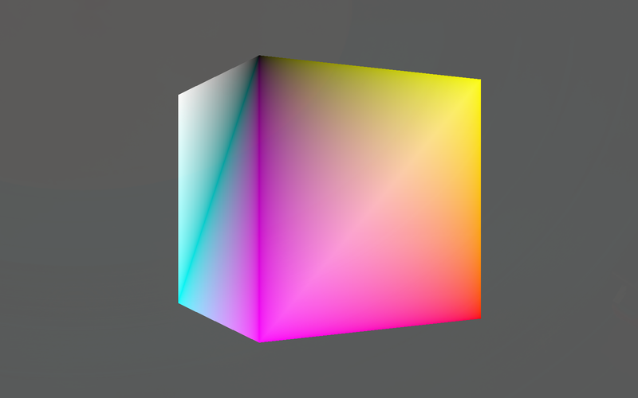

# Vulkan Template (C++)

A small, modular Vulkan 1.3 starting point in modern C++, built with CMake. It opens a window and renders a spinning, vertex-colored cube with a depth buffer — everything you need before writing your own rendering code.

<p align="center">
  
</p>

## Features

- **Vulkan 1.3**: dynamic rendering (no render pass or framebuffer objects) and synchronization2 barriers
- **Swapchain recreation** on resize and when out of date; waits while minimized
- **VSync by default** (FIFO present mode); set `ENABLE_VSYNC` to `false` in `VulkanContext.hpp` to prefer uncapped MAILBOX
- **sRGB swapchain** format when the surface offers one, so colors are gamma-encoded correctly
- **Two frames in flight** with per-frame command buffers and fences, per-image present semaphores
- **Depth buffer** with automatic format selection
- **GPU selection** that prefers a discrete GPU and checks swapchain, surface and Vulkan 1.3 support
- **Validation layers** in Debug builds, including synchronization validation, with warnings and errors routed through the app's logger and Vulkan objects labeled with debug names
- Mesh data uploaded through a staging buffer into GPU-only memory; per-frame uniform buffers stay persistently mapped
- Uniform buffer + descriptor set for model/view/projection matrices
- Camera, timer and math helpers, and input with held and per-frame key and mouse button states, mouse and scroll deltas, and cursor capture
- GLSL shaders compiled to SPIR-V for Vulkan 1.3 by the build (with debug info in Debug builds), rebuilt when included files change, and loaded from beside the executable
- An `assets/` folder copied next to the executable on every build, for textures, models and other files

## Requirements

- A C++17 compiler (GCC, Clang or MSVC)
- CMake 3.21 or newer
- Vulkan 1.3 capable GPU and driver
- Vulkan headers and loader, `glslc`, and (recommended for Debug builds) the Khronos validation layer; without it, Debug builds run without validation and log a warning
- GLFW 3 and GLM

### Arch Linux

```bash
sudo pacman -S cmake ninja vulkan-headers vulkan-icd-loader vulkan-validation-layers shaderc glfw glm
```

### Ubuntu / Debian

```bash
sudo apt install cmake ninja-build libvulkan-dev vulkan-validationlayers glslc libglfw3-dev libglm-dev
```

Older releases may lack `glslc`; install the [LunarG Vulkan SDK](https://vulkan.lunarg.com/) instead.

### Windows

1. Install the [LunarG Vulkan SDK](https://vulkan.lunarg.com/) (provides headers, loader, `glslc` and validation layers).
2. Install [vcpkg](https://vcpkg.io/) and pass its toolchain when configuring: `-DCMAKE_TOOLCHAIN_FILE=<vcpkg-root>/scripts/buildsystems/vcpkg.cmake`. GLFW and GLM are then installed automatically from `vcpkg.json`.

## Build and run

```bash
cmake -S . -B build -G Ninja -DCMAKE_BUILD_TYPE=Debug
cmake --build build
./build/VulkanTemplate
```

- **Debug** builds enable the validation layer (with synchronization validation) and debug names for Vulkan objects; **Release** (`-DCMAKE_BUILD_TYPE=Release`) disables both.
- The executable and its `shaders/` and `assets/` folders are placed in the build directory, so it can be launched from any working directory.
- Ninja and Makefile builds also write `compile_commands.json` to the build directory for clangd and other tools.
- On Windows, `cmake -S . -B build -G "Visual Studio 17 2022"` generates a solution with `VulkanTemplate` as the startup project (or open the folder directly in Visual Studio).
- On laptops with hybrid graphics the discrete GPU is chosen automatically; the selected GPU is printed at startup.
- `--frames N` exits after rendering N frames, for automated tests.
- The app exits with a failure code if the validation layer reported any errors, after printing how many.

## Continuous integration

`.github/workflows/build.yml` builds Debug and Release on Linux and Windows on every push and pull request. The Linux Debug job also runs the app for 300 frames on lavapipe (Mesa's CPU Vulkan driver) in a virtual X display, with validation and synchronization validation enabled, so validation errors fail the build even without a GPU.

To run the same check locally on Linux, install lavapipe and Xvfb (`vulkan-swrast` and `xorg-server-xvfb` on Arch, `mesa-vulkan-drivers` and `xvfb` on Ubuntu) and run a Debug build:

```bash
env -u WAYLAND_DISPLAY VK_DRIVER_FILES=$(ls /usr/share/vulkan/icd.d/lvp_icd*.json) \
    xvfb-run -a -s "-screen 0 1280x720x24" ./build/VulkanTemplate --frames 300
```

## Project structure

```
CMakeLists.txt        Build configuration (app name and version, sources, shaders, assets)
assets/               Files copied next to the executable, loaded with Paths::asset()
shaders/              GLSL sources, compiled to SPIR-V at build time
src/
  main.cpp            Entry point
  VulkanContext       Owns everything; init, frame loop, swapchain recreation, cleanup
  VulkanWindow        GLFW window, surface, resize tracking
  VulkanInstance      Instance, validation layers, debug messenger
  VulkanDevice        Physical device selection, logical device, queues, debug names
  VulkanSwapChain     Swapchain images and views
  VulkanPipeline      Graphics pipeline and descriptor set layout
  VulkanCommand       Command buffers and per-frame recording (barriers + dynamic rendering)
  VulkanSync          Semaphores and fences
  VulkanBuffer        Buffer + memory helper
  VulkanImage         Image + memory + view helper (used for depth)
  Mesh, CubeMesh      Vertex/index buffers and the demo cube
  Camera, Input, Timer, Math, Utils, Paths, ShaderLoader
```

## Starting a new project

1. Rename the project: change `project(VulkanTemplate VERSION 1.0.0)` (name and version) and `APP_TITLE` at the top of `CMakeLists.txt`.
2. Replace `CubeMesh` with your own geometry and edit the shaders in `shaders/` (add new ones to the `SHADERS` list in `CMakeLists.txt`). Put other files in `assets/` and load them with `Paths::asset("...")`.
3. Per-frame logic lives in `VulkanContext::drawFrame()`; draw commands are recorded in `VulkanCommand::recordCommandBuffer()`.

## Credits

Forked from [ragulnathMB/VulkanProjectTemplate](https://github.com/ragulnathMB/VulkanProjectTemplate).

## License

MIT License — see the [LICENSE](LICENSE) file.
